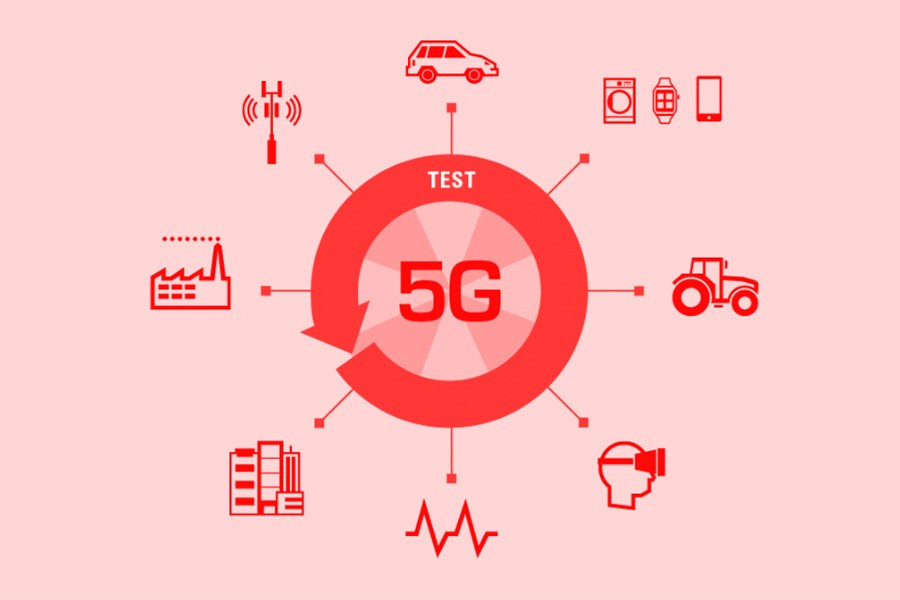
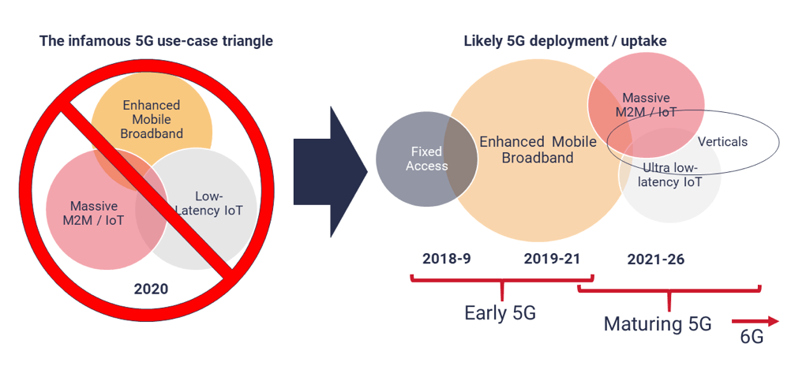

Mạng 5g có những ưu điểm gì so với 4G?

Nó mang lại nhiều ưu điểm vượt trôi so với 4g, ví dụ như:
+ Tốc độ cao hơn
+ Độ trễ thấp hơn
+ Khả năng kết nối các thiết bị đa dạng
+ Tăng cường dung lượng mạng
+ HỖ trợ công nghệ mới

# **I. Các dịch vụ sẽ được triển khai trên nền mạng 5G**

>> Mô tả tổi thiểu 5 dịch vụ được triển khai trên nền mạng 5g

- mạng 5g trên thực tế có thể có đường truyền tối đa lên đến 10Gbps. và rõ ràng là nhanh hơn rất nhiều lần so với 4G. trong điều kiện thực tế, tốc độ của mạng 5g có thể lên đến 1gbps (nhanh hơn gấp 10 lần so với 4g)
- người dùng viettel có thể sử dụng và đăng ký các gói dịch vụ 5g đầu tiên.
vinaphone cũng đã cung cấp dịch vụ miễn phí cho người dùng trong những khu vực có các khu vực phủ sóng. vào cuối năm nay, vinaphone đang có kế hoạch hoàn thành việc lắp đặt 3000 trạm gốc 5g trên toàn quốc.
- Đầu tháng 10/2024, mobiphone đã kí biên bản ghi nhớ với ericsson để hợp tác thành lập trung tâm đổi mới sáng tạo 5g tại cơ sở của mobifone tại việt nam.
- Trung tâm sẽ được thiết kế để phục vụ như một không gian đồng sáng tạo với mạng sandbox 5g hiện đại và sẽ được sử dụng để phát triển truowgnf hợp sử dụng với sự hợp tác của các đối tác ở việt nam và các nơi khác trên toàn cầu. hai công ty sẽ thúc đẩy trung tâm đổi mới 5g như một môi truowgnf đổi mới năng động cho người tiêu dùng và doanh nghiệp. 
- theo chiến lược đến năm 2025, tầm nhìn đến năm 2030, phó thủ tướng thường trực nguyễn hòa bình kí ban hành vùng phủ sóng mạng di động 5g dự kiến đến tất cả các thành phố, tỉnh, khu công nghệ cao, trung tâm nghiên cứu và phát trienr, khu công nghiệp và nhà ga, cảng và sân bay quốc tế vào năm 2025 và 99% dân số vào năm 2030

- Có nhiều dịch vụ có thể cùng 5g phát triển một cahcs cực kì nhanh chóng trong tương lai:
    + Thực tế ảo và thực tế ảo tăng cường: trải nghiệm được các công nghệ thực tế ảo mới như ar hay vr trơn tru không bị giật lag bởi vì tốc độ cao và độ trễ thấp của 5g. 
    
    + Xe tự lái: trong môi trường có sự biến động rất cao trong quá trình phát triển xe điện, có nghĩa là chúng tsa sẽ được tiếp cận các dòng xe tự lái hiện đại hơn trong tương lai. Từ lợi thế có được đường truyền ổn định và nhanh chóng nhờ công nghệ, xe tự vận hành sẽ là một trong những huowgns tự động hóa được để tâm đến trong thời gian tới của việt nam cũng như trên toàn thế giới. 

    + Chăm sóc sức khỏe: áp dụng 5g trong lĩnh vực y tế sẽ là một bước nhảy trong chẩn đoán và đảm bảo y tế theo thời gian thực, giảm thiểu các truwongfh ợp vượt tuyến... với các công nghệ cảm biến device-based nhằm thu thập thông tin người dùng liên tục, cải thiện tối đa dịch vụ sức khỏe hằng ngày cho người dùng và giúp các bác sĩ có thể theo dõi và phát hiện các bệnh tật sớm. 

    + Xa hơn nữa là công nghệ nhà máy thông minh. nơi có những hệ thống siêu kết nối được thành lập. Các nhà máy có thể có những mạng lưới kết nối hàng ngàn htieet bị thông minh như camera, cảm biến để tự đông nhận và phân tích dữ liệu hiệu quả và tiết kiệm chi phí hơn. ví dụ như công nghệ cảm biến thông minh có thể đưa ra dự đoán chính xác về vòng đời các thiết bị và cung cấp những thông tin cho đội ngũ điều hành, qua đó lập kế hoạch ứng phó và tránh bị động trong mọi tình huống. 

    + điện toán biên: là quá trình cung cấp khả năng lưu trữ và phân tích dữ liệu gần hơn với các điểm end-point của chúng ta. NGười dùng có thể xây dựng các ứng dụng hiệu suất cao có thể xử lý và lưu trữ dữ liệu ở gần nơi dữ liệu được tạo ra, cho phép độ trễ cực thấp và phản hồi thông minh theo thời gian thực. Với chất lượng ngày càng caocuar các trường hợp sử dụng điện thoán biến và uyeeu cầu về dữ liệu, cần có một tốc độ mạng dủ cao để phản hồi theo thời gian thực. do đó cơ sở hạ tầng mạng 5g hỗ trợ và tạo điều kiện cho tính phức tạp và mức độ chuyên môn hóa ngày càng cao của điện toán biên. 
    

    + Smart city: mô hình thành phố thông minh sử dụng chủ ysu đó chính là các IoTs để thu thập thông tin cũng như để xử lý thông tin bằng thời gian thực. Dựa vào khả năng truyền dẫn cao và khả năng kết nối nhiều loại thieetss bị, đây là một bước đột phá công nghệ throng tương lại, là một chất xúc tác để các thành phố lớn kết nối được với nhau.

    + Chính phủ số: trong Quyết định số 942/QĐ-TTg của Thủ tướng Chính phủ về Phê duyệt Chiến lược phát triển CPĐT hướng tới Chính phủ số giai đoạn 2021 - 2025, định hướng đến năm 2030 đã đặt mục tiêu người dân, doanh nghiệp có thể sử dụng các dịch vụ số theo nhu cầu cá thể hóa, thuận tiện, dễ dàng, không giấy tờ và không cần sự hiện diện nếu pháp luật không yêu cầu. PHát triển chính phủ điện tử, chính phủ việt nam được xác định phải gắn liền với việc giải quyết các vấn đề lớn từ  đó phục vụ người dân và doanh nghiệp được tốt hơn. Phát triển chính phủ điện tử, chính phủ số cũng chính là hướng tới phát triển kinh tế số, xã hội số và làm cho người dân giàu hơn, hạnh phúc hơn [1] 
    + 5G sẽ đóng vai trò quan trọng trong việc xây dựng nền kinh tế kĩ thuật số: góc nhìn từ chuyên gia

# II. **Tiến độ triển khai mạng 5g tại việt nam hiện nay**

1. Một số thông tin về tình hình phủ sóng mạng 5g ở Việt nam hiện tại

- Ở hà nội, viettel đã phủ sóng các khu vực trung tâm như quận hoàn kiếm, ba đình, 2 bà trưng và một số địa điểm như trụ sở tập đoàn vtel, khu đô thị vinhomes thăng long, nhà thờ lớn và nhà hát lớn thuộc quận hoàn kiếm

- Tại hồ chí minh, cả viettel và vnpt đều đã triển khai 5g ở những khu vực chính. VT tập trung vào các địa điểm nổi bật như phố đi bộ nguyễn huệ, một phần quận 10 và thành phố thủ đức. VNPT phủ sóng khu vực quận 1 với các địa điểm như nhà thờ đức bà, bến bahcj đằng và các tyến đường đông đúc như đồng khởi, pasteur...

- Ngoài 2 thành phố lớn kể trên, nhiều tỉnh thành các trên cả nước cũng đã bắt dầu triển khai mạng 5g, và có một số khu vực phủ sóng 5g nhằm phục vụ các nhu cầu về công nghiệp, sản xuất hay các trung tâm hành chính địa phương.

2. Tình trạng hiện nay của các nhà mạng 
    + mạng 5g hiện nay ở việt nam đã đạt được 3 triệu người dùng trong 2 tuần vào quảng đầu tháng 10 năm 2024, được thúc đẩy bởi chiến lược nâng cấp tự động cuaqr viettel cho phép người dùng có thiết bị tương thích chuyển đổi từ 4g ở khu vực thành thị
    + Như vậy, chỉ trong đầu tháng 10, đã có đến 3 triệu người dùng tiếp cận với công nghệ 5g, tập trung nhiều nhất ở Hà nội, tp hồ hcis minh, bình udonwg , đồng nai và hải phòng, chiếm đến gần 50% tổng số thuê bao 5g 
- Các băng tần được sử dụng cho 5g được triển khai hiện tại
với viettel:
mobifone: https://en.vietnamplus.vn/mobifone-ericsson-collaborate-on-plans-for-5g-innovation-hub-in-vietnam-post297570.vnp
đã có kế hoahcj hợp tác với ericsson để có thể tạo ra một môi truowgnf sandbox phát triển công nghệ 5g tại việt nam.

3. tốc độ triển khai thực tế của các nhà mạng
3.1. Mobifone
- hiện nay mạng 5g của mobifone đã được thử nghiệm và phủ sóng tại một số tỉnh thành trên toàn quốc.
- Giai đoạn 2023 đến 2025 sẽ xác định mục tiêu thực hiện chương trình chuyển đổi số quốc gia đến năm 2025, định hướng mục tiêu đến năm 2030, sẽ đồng hành cùng CHính phủ phát triển Chính phủ số, kinh tế số, xã hội số, sẵn sàng về mặt hạ tầng và công nghệ cho việc thương mại hóa 5g chính thức tại việt nam. 
- ngày 9/7/2024 vừa qua, tổng công ty viễn thông Mobifone đã tham gia đấu giá và trở thành nhà mạng giành được quyền sử dụng tần số vô tuyến điện khối băng tần c3 (3800 - 3900MHZ )
- ngày 27/9/2024, mobifone đã ký kết thỏa thuận hợp tác chiến lược với tập đoàn an ninh mạng F-secure đánh dấu một bước chuẩn bị của nhà mạng trong việc đưa mạng 5g vào thương mại một cách an toàn, ổn định và đảm bảo tận hưởng trọn vẹn công nghệ cho khách hàng.
-
3.2. Viettel
- tính đến thời điểm hiện tại, viettel đã triển khai mạng 5g phổ biến trên nhiều tỉnh thành của Việt Nam, chúng ta có thể theo dõi ở dữ liệu được cập nhật ở [4].

4. Lộ trình thương mại hóa 5g trên 63 tỉnh thành
- Trong một thông cáo báo chí mới đây của Viettel, chi biết đang có kế hoạch khai trương mạng 5g trên toàn nước trong tháng 10 và đã được thông báo tới báo chí vào buổi công bố thương mại hóa mạng 5g vào []
- Theo một số báo cáo và một vài nguồn tin trên internet, tính đén thời điểm hiện tại, viettel đã lắp ráp các trạm 5g tại tất cả cá tỉnh thành. Trong nhiều tháng qua thì nhà mạng này đã thực hiện đăng tải htoong tin đấu thầu về cung cấp di9chj vụ tư vấn giám sát và thiết kế các giải pháp trạm 5g ở hàng loạt các tỉnh thành và khu vực trên hệ htoongs mạng đấu thầu quốc gia theo quy định
- Đến năm 2030, toàn bộ người dùng sẽ được kết nối internet cáp quang tốc độ cao với ít nhất 1Gbps và đồng thời mạng 5G sẽ phủ sóng gần như toàn bộ dân số. Bên cạnh đó, các nhà mạng cũng sẽ đầu tư vào các vấn đề nghiên cứu để tăng cường tính tự chủ cho việt nam 

5. Băng tần sử dụng cho 5g
- Tại việt nam sử dụng băng tần theo quy hoạch có 3 dải tần:
    + 2500 - 2600 MHZ
    + 3700 - 3800 MHZ
    + 3800 - 3900 MHZ
Ba dải tần này có số lượng thiết bị đầu cuối tương thích tuowgn đương nhau vì các băng tần này đền là băng tần phổ biến cho mạng 5g trên thế giới.
- Theo viện công nghệ Massachisetts (mĩ), băng tần có tần số càng cao sẽ có băng thông lớn, tốc độ mạng, độ trễ thấp và dung lượng cao hơn so với băng tần tần số thấp [2]

- theo các chuyên gia, khối băng tần 5g mà việt nam vừa đấu giá thành công có diện tích phủ lớn hơn từ 1.6 đến 1.7 lần mà VNPT đấu giá thành công, do đó với cùng một diện tích như nhau thì Viettel cần 100 trạm thu và phát sóng thì VNPT phải dùng tới gần 170 trạm. Đây cũng là lý do khiến cho các nhà mạng quyết định chi một số tiền lớn ban đầu để giảm chi phí đầu tư về lâu về dài [2].

- Ở góc độ chuyên gia, chia sẻ thông tin với KTSG Online, ông Đoàn Quang Hoan, Phó chủ tịch Hội Vô tuyến Điện tử Việt Nam, cho biết băng tần 2500-2600 MHz có độ phủ rộng hơn nên giúp nhà mạng tiết kiệm chi phí triển khai các trạm thu phát sóng. Ngoài ra, đây còn là băng tần duy nhất cho phép triển khai cả mạng 4G và 5G (các băng tần 3700-3800 MHz và 3800 - 3900 MHz chỉ dùng được cho 5G). Băng tần 2500-2600 MHz sẽ giúp tăng chất lượng dịch vụ mạng 4G và triển khai 5G. [2]

III. Nguồn thông tin tham khảo của Bình

[3]. https://vanban.chinhphu.vn/default.aspx?pageid=27160&docid=203403: quyết định số 942/QD-TTg của thủ tướng chính phủ: phê duyệt chiến lược phát triển chính phủ điện tử hướng tới chính phủ số giai đoạn 2021-2025, định hướng đến năm 2030. 

[1]. https://ictvietnam.vn/trien-khai-mang-5g-tao-dieu-kien-chinh-phu-dien-tu-phat-trien-manh-me-67122.html#:~:text=Theo%20Chi%E1%BA%BFn%20l%C6%B0%E1%BB%A3c%20h%E1%BA%A1%20t%E1%BA%A7ng,m%E1%BA%A1ng%205G%20v%C3%A0o%20n%C4%83m%202030.

[2]. https://thesaigontimes.vn/bang-tan-5g-lan-luot-co-chu-ky-vong-som-cai-thien-toc-do-internet-di-dong/#:~:text=B%C4%83ng%20t%E1%BA%A7n%205G%20t%E1%BA%A1i%20Vi%E1%BB%87t,m%E1%BA%A1ng%205G%20tr%C3%AAn%20th%E1%BA%BF%20gi%E1%BB%9Bi.

[4]. https://media.vietteltelecom.vn/upload/ckfinder/files/Vung%20phu%205G%20Viettel_Update%2024_10.pdf

[5]. https://en.vietnamplus.vn/5g-will-play-key-role-in-building-digital-economy-experts-post297425.vnp

[6]. https://viettelidc.com.vn/tin-tuc/nhung-ung-dung-tiem-nang-cua-mang-5g